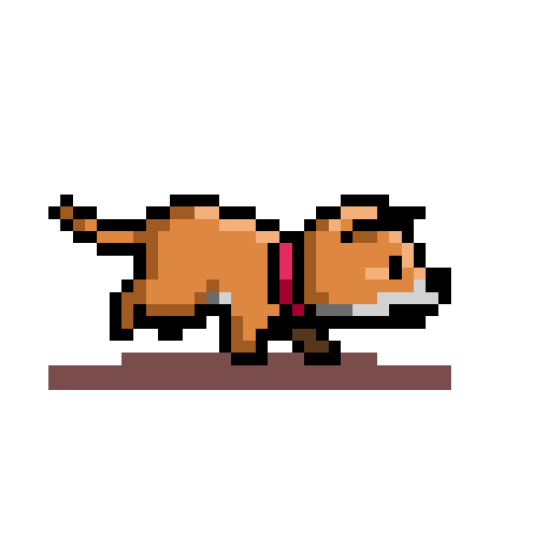

    <h1 align="left"> Juan Diego Andrade Cardozo</h1>
    

**`Software Developer [Python Django Back-End Developer]`**

Welcome to my GitHub profile, I'm Juan Diego! 🌟 As a highly motivated and disciplined computer science student, I'm fully committed to pursuing a career in back-end development. Through a mix of self-learning and teaming up with my peers, I'm always on the grind to sharpen my skills and achieve my goal of becoming a top-notch back-end developer. 👨‍💻 Let's connect and create something amazing together! 🚀

    
    

 
<h2 align="left">🌟 Languages & Tools</h2>

    
    
    
    
    
    
    
    
    
    
    
    
        

 
<h2 align="left">📊 GitHub Statistics</h2>

    
    

 
 

